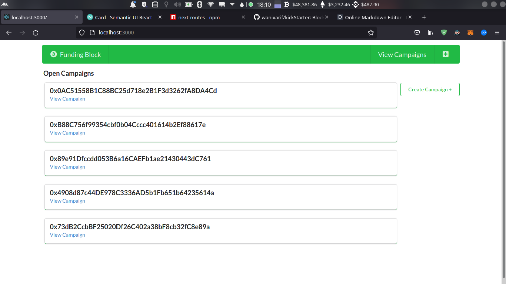
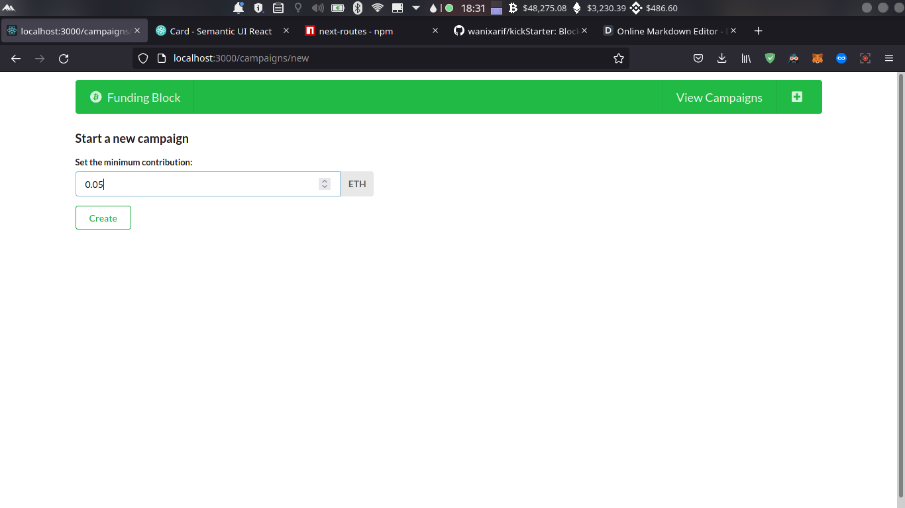
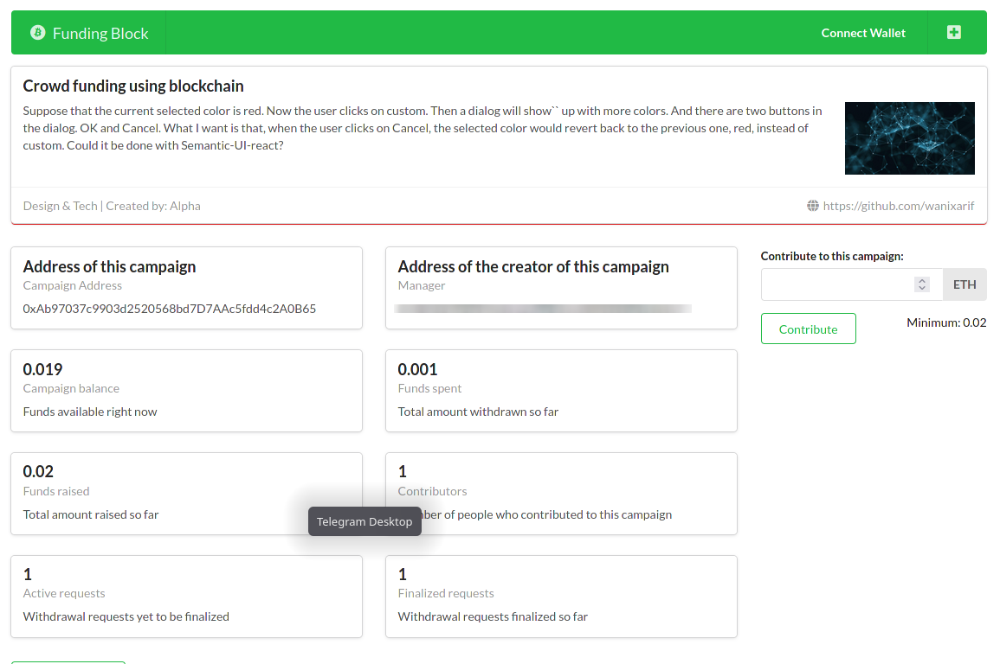
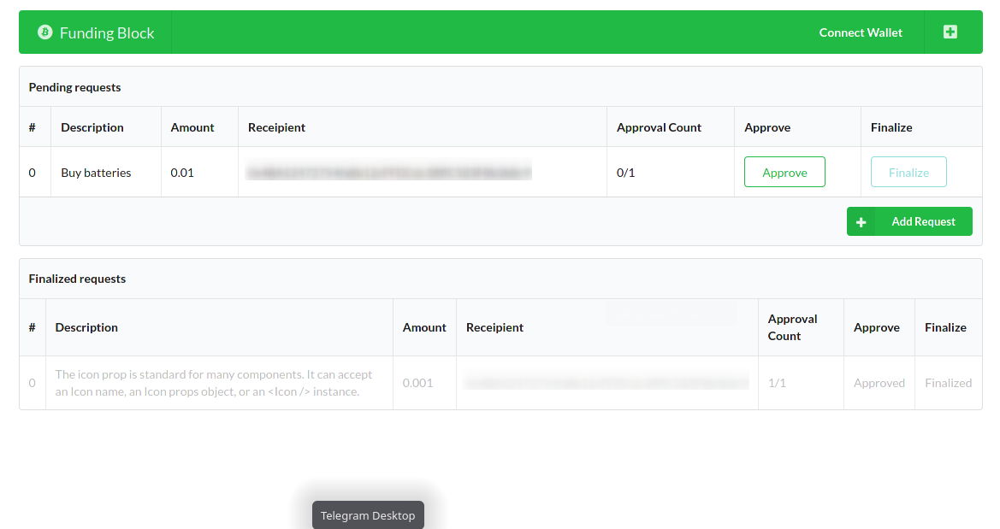
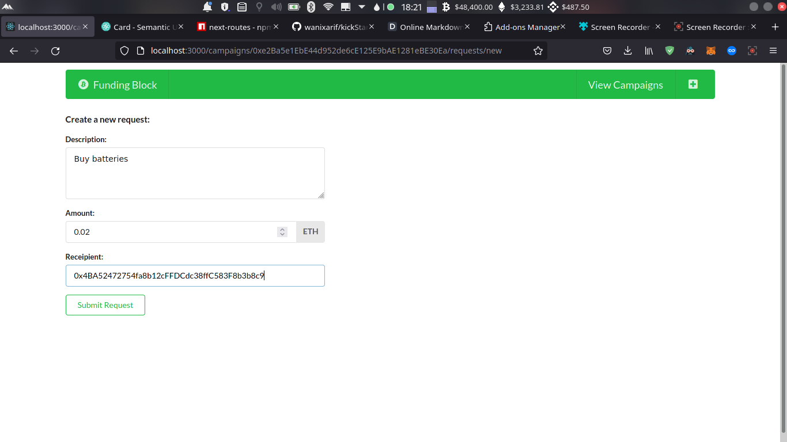

# Funding Block
## _Crowd funding using Blockchain_

Funding block is a fund raiser like kick starter but with the power of blockhain and governance on withdrawals.


## Features

- Funding request must pass >50% votes
- Funds can't be withdrawn without approval
- Withdrawal address is public
- 
## Installation

Requires [Node.js](https://nodejs.org/) to run.

Clone this repo
```sh
git clone https://github.com/wanixarif/fundingBlock
```

Install the dependencies & start the developmental server.

```sh
cd fundingBlock
npm install
npm run dev
```

For production environments...

```sh
#COMING SOON
```

> Note: `ethereum/KEYS.js` is required for Seed phrase & Infura Api.
Added to gitignore currently for obvious reasons ;)

Verify the deployment by navigating to your server address in
your preferred browser.

```sh
127.0.0.1:3000
```

## Screenshots
Home


Start a new campaign


Campaign details


Funding requests


Create a funding request


## License

GNU GPL V3

**Free Software, Hell Yeah!**

PS: Shout out to https://dillinger.io/ for making it easier to generate this readme, I'm not well versed in markdown :)
