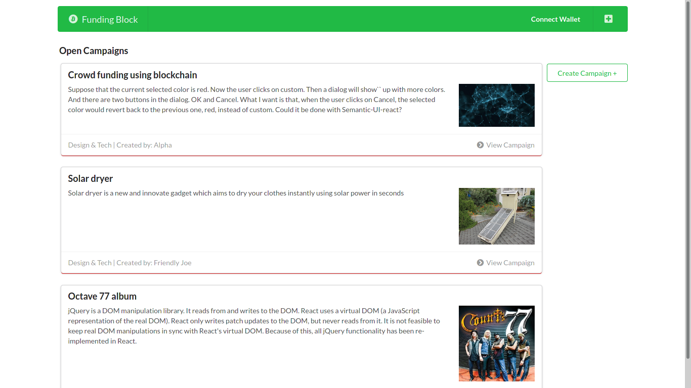
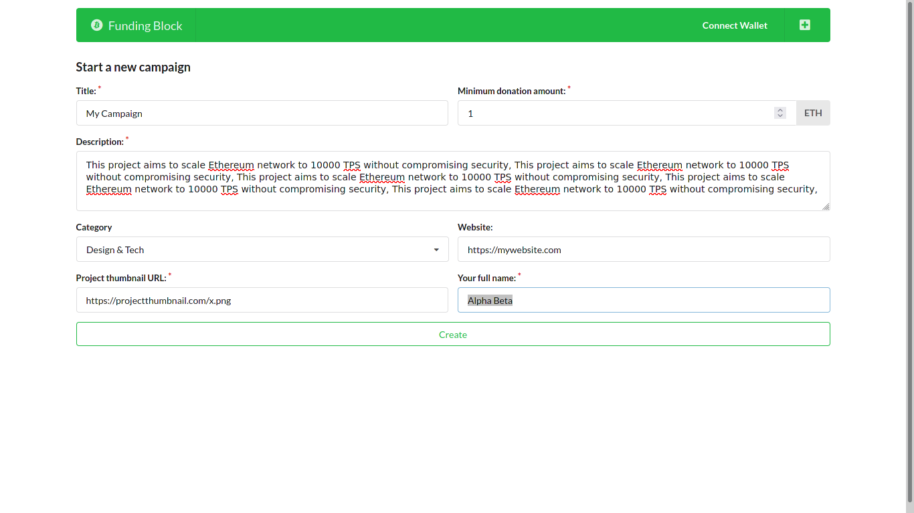
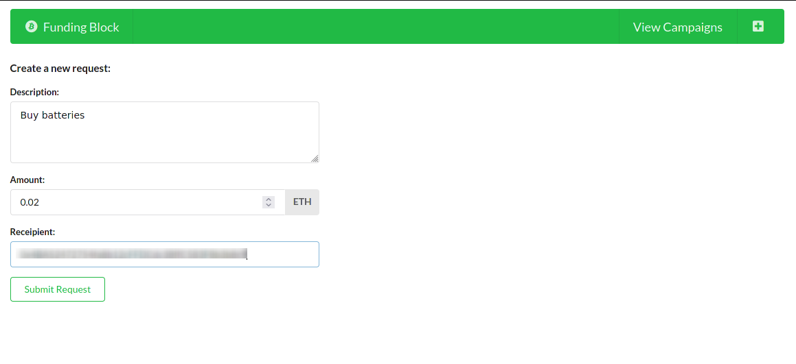

# Funding Block
## _Crowd funding using Blockchain_

Funding block is a fund raiser like kick starter but with the power of blockhain and governance on withdrawals.


## Features

- Funding request must pass >50% votes
- Funds can't be withdrawn without approval
- Withdrawal address is public
- 
## Installation

Requires [Node.js](https://nodejs.org/) to run.

Clone this repo
```sh
git clone https://github.com/wanixarif/fundingBlock
```

Install the dependencies & start the developmental server.

```sh
cd fundingBlock
npm install
```

## Compilation

```sh
node ethereum/compile.js
```

## Deployment

```sh
cp ethereum/KEYS.json.example ethereum/KEYS.json
```

Put Your Seed phrase and Infura API key and then run

```sh
node ethereum/deploy.js
```

Copy the contract address and put it in ethereum/factory.js

## Testing

```sh
node test/Campaign.test.js
```

## Server deployment

```sh
npm run dev
```

Verify the deployment by navigating to your server address in
your preferred browser.

```sh
127.0.0.1:3000
```

## Screenshots
Home


Start a new campaign


Campaign details


Funding requests


Create a funding request


## License

GNU GPL V3
